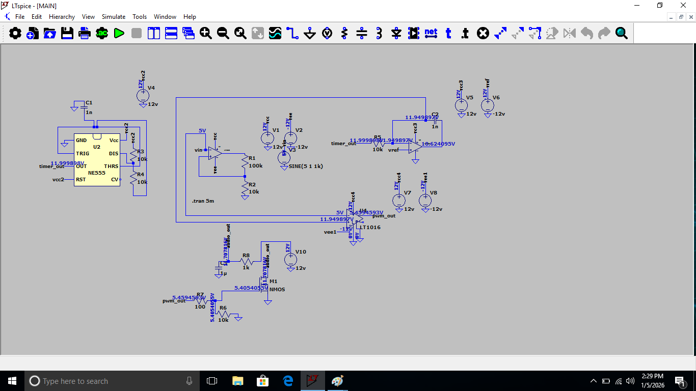
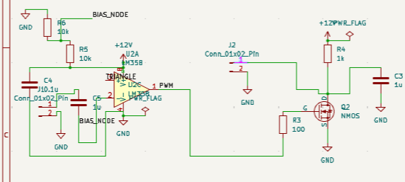
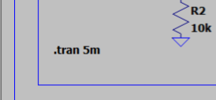
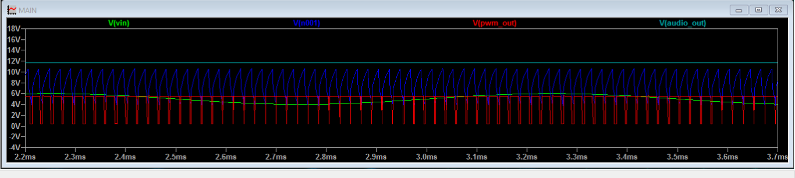
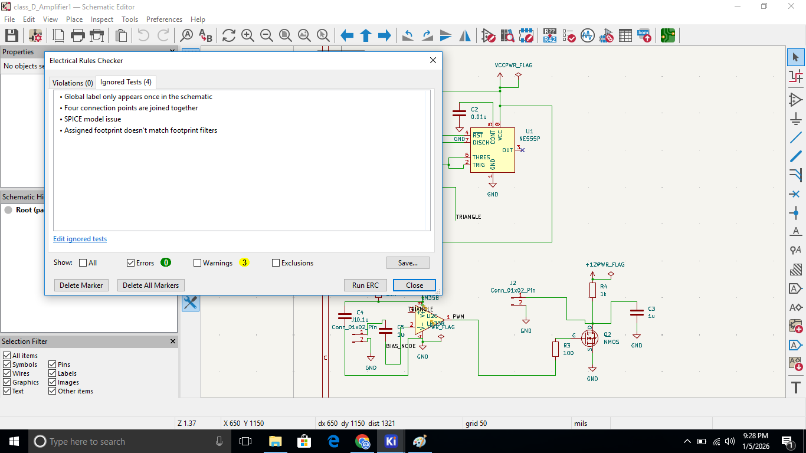
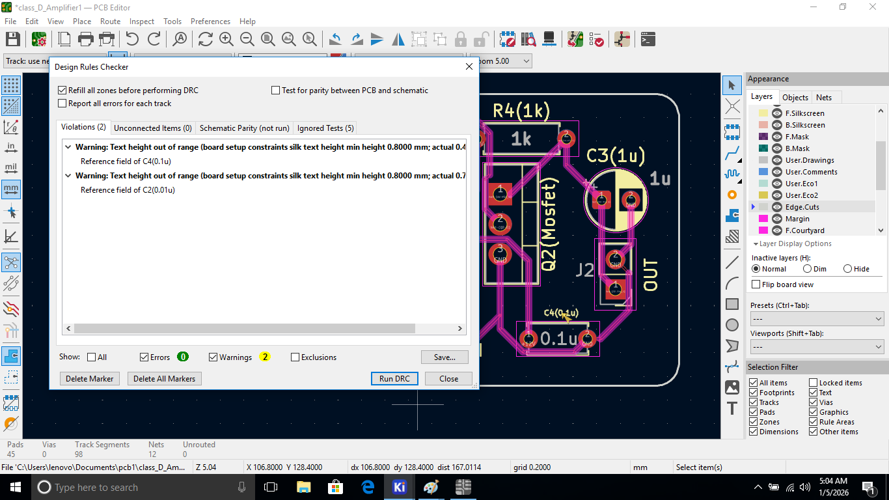
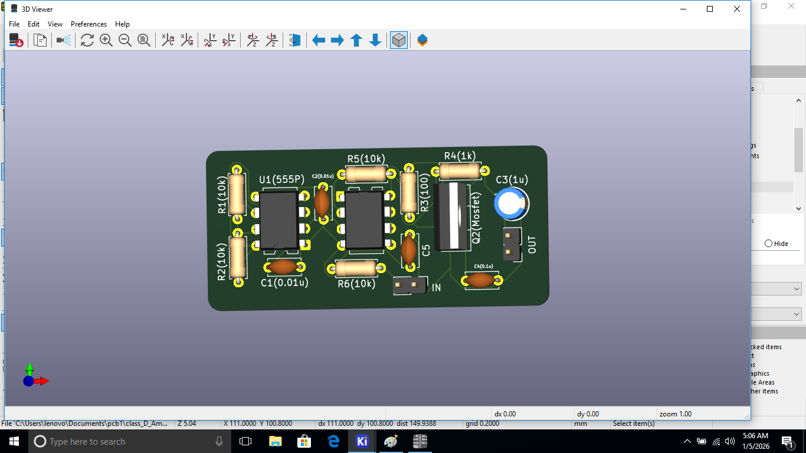

# TITLE: Design and Simulation of a Class-D Audio Amplifier Using Timer IC and Op-Amp

# DESCRIPTION: 
## Class-D audio amplifiers achieve high efficiency by converting analog audio signals into high-frequency Pulse Width Modulated (PWM) signals. Unlike linear amplifiers, power loss is minimized since the switching devices operate only in fully ON or OFF states.This project focuses on the design, simulation, and implementation of a Class-D audio amplifier without using any dedicated Class-D amplifier IC. Instead, commonly available components such as a 555 timer, operational amplifiers, MOSFETs, and passive elements are used. The complete design workflow includes circuit simulation, PCB schematic capture, layout and routing, 3D visualization, and detailed documentation of the design approach.

# METHODOLOGY: 
## •Generated a high-frequency carrier waveform using a 555 timer
## •Conditioned the audio input signal for PWM comparison
## •Generated PWM using an operational amplifier configured as a comparator
## •Implemented power switching using an NMOS transistor
## •Applied passive filtering to recover the amplified audio output
## •Verified circuit operation through simulation using LTspice
## •Completed schematic capture and PCB layout using KiCad
## •Performed routing and 3D visualization of the PCB.

# COMPONENTS REQUIRED:
## HARDWARE COMPONENTS:
### 1) Timer IC-NE555
### 2) Op-Amp -LM358 & LM1016
### 3) MOSFET-NMOS
### 4) Capacitors-(0.01µF,0.1µF,1µF)
### 5) Resistors-(100Ω,1kΩ,10kΩ,100kΩ)
### 6) Power Supply-(+12V,-12V DC)
### 7) Connectors-J1 & J2

## SOFTWARE COMPONENTS:
### 1) LTspice 
### 2) KiCad 
### 3) Github

# JUSTIFICATION(LTspice):
## • NE555 Timer IC: Used to generate a stable high-frequency carrier waveform for PWM generation. Selected for its simplicity, reliability, and wide availability.
## • LM358 Operational Amplifier: Used as a comparator to generate PWM by comparing the audio signal with the carrier waveform. Chosen for its single-supply operation and suitability for low-frequency audio applications.
## • LM1016 Operational Amplifier: The LM1016 is chosen over the LM358 for PWM generation due to its faster switching speed and sharper transitions, which produce a cleaner and more accurate PWM signal. The LM358 is better suited for low-frequency signal conditioning and is less effective at high-frequency switching.
## • NMOS Transistor: An NMOS transistor is used as the switching device to drive the PWM signal due to its high switching speed, low conduction losses, and high efficiency. Compared to linear devices, NMOS transistors operate effectively in ON/OFF states, making them ideal for high-efficiency Class-D amplifier operation.
## • Resistors: (i)100 Ω – Used for current/gate limiting to protect switching devices and reduce high-frequency noise.(ii)1 kΩ – Used for signal conditioning to control current flow without loading the circuit.(iii)10 kΩ – Used for biasing and pull-up/pull-down functions to ensure stable logic levels with low power consumption.(iv)100 kΩ – Used in timing and reference networks to minimize current draw while maintaining stability.
## Capacitors: (i)0.01 µF – Used in the timer control/timing circuit to stabilize waveform generation and suppress noise.(ii)0.1 µF – Used as a decoupling capacitor to filter high-frequency supply noise near ICs.(iii)1 µF – Used for coupling and filtering to block DC components while passing low-frequency audio signals.

# CIRCUIT WORKING & DESIGN:

## The input audio signal (Vin) is a low-amplitude sine wave, typically below 1 V. A 555 timer operating from a 12 V supply generates a high-frequency triangular carrier waveform with an amplitude between approximately one-third and two-thirds of the supply voltage. The audio signal is compared with this carrier to produce a PWM signal switching between 0 V and 12 V, with its duty cycle varying in proportion to the audio signal amplitude. This PWM signal drives the gate of the NMOS transistor, which switches the load at high frequency and produces a high-power PWM waveform at the drain. After passing through a passive low-pass filter, the switching components are removed and an amplified audio output is obtained. The recovered audio output is an analog waveform whose peak voltage is typically several volts (up to approximately 10–12 V peak, depending on the supply and load), suitable for driving the output stage.

### NOTE: 

#### •R5 & R6 – Used to generate the required DC offset reference voltage for proper PWM comparison.
#### •C4 – Used to smooth and stabilize the DC offset voltage.
#### •C5 – Used to suppress high-frequency noise affecting the DC offset.

# HOW TO RUN/USE: 
## Step1:Open the Class-D amplifier schematic file in LTspice.
## Step2:Run a transient (.tran 5m) simulation to observe time-domain waveforms.

## Step3:Verify the triangular carrier, PWM output, and MOSFET gate waveform.

## Step4:Observe the filtered audio output waveform at the output node.

## Step5:Open the schematic in KiCad and perform Electrical Rule Check (ERC).

## Step6:Open the PCB editor, complete routing, and verify using Design Rule Check (DRC).

## Step7:Use the 3D Viewer to inspect component placement and board layout.

